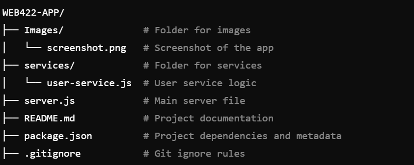

## WEB422-APP

## Overview
The WEB422-APP is a modern, responsive web application created to demonstrate proficiency in React and related technologies. It is built as part of a course project for WEB422, focusing on implementing CRUD operations, data handling, and API integration. This project serves as a showcase of front-end development skills, including component-based architecture and state management.

## Features
**CRUD Operations:** Perform Create, Read, Update, and Delete actions on data.

**API Integration:** Fetches and displays data from external APIs.

**Responsive Design:** Optimized for mobile, tablet, and desktop views.

**Dynamic Data Handling:** Supports real-time updates and state management.

## Built With
**React:** Core library for building user interfaces.
**JavaScript (ES6+):** Modern JavaScript syntax and features.
**CSS:** Styles the application for an appealing user interface.
**React Router (optional):** For handling navigation within the app.

## Project Structure
The project follows a modular structure, with each component stored in separate files under a /components directory for reusability and scalability.

## License
This project is licensed under the MIT License. See the LICENSE file for more details.

## Contact
For any questions or feedback, please reach out:

**GitHub:** @danmschaffer

**Email:** danmschaffer@outlook.com
